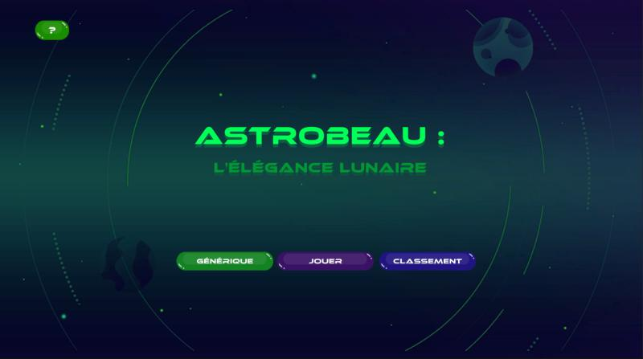
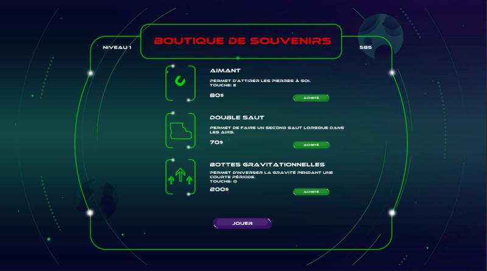
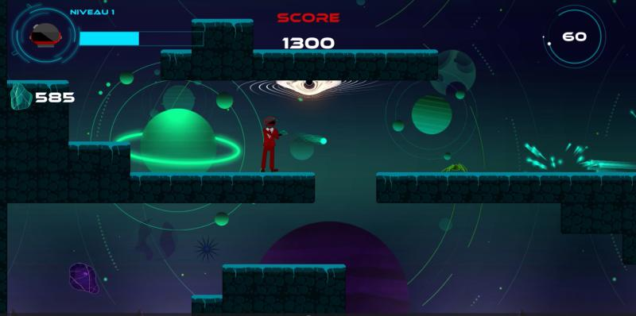
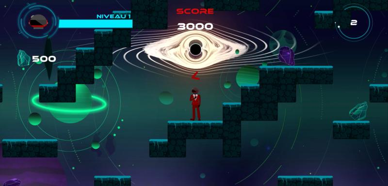

# Astrobeau #
Astrobeau est un jeu de plateforme conçu lors du cours de Jeux 4 avec la collaboration de Julie Filiatrault-Légaré (Artiste) et d'Olivier Dion (Programmeur). Pour ce faire, nous avons utilisé le logiciel Unity dans lequel nous avons programmé les différentes mécaniques en se servant du langage C#. Ce projet, fut, pour moi, le premier projet d'équipe d'ampleur j'ai donc dû développer mes capacités de communication et mon savoir-faire afin de parvenir à le mener à bien. Lors de ce travail, j'ai dû programmer les déplacements du personnage ainsi que certains bonus achetables en boutique tel que la capacité d'inverser la gravité ou de pouvoir resauter dans les airs. J'ai également programmé l'apparition des différentes salles de façon aléatoire au début de chaque niveau tout en permettant d'instancier certains objets à des endroits clés dans celles-ci. De plus, j'ai créé un effet de trou noir à l'aide de Shaders que j'ai ensuite programmé pour engloutir l'écran à la fin du temps octroyé au joueur pour compléter un niveau. Pour finir, j'ai créé la mécanique de tir avec le personnage ainsi que des ennemis sous la forme de nids destructibles crachant des araignées coursant le joueur tout en tentant de lui sauter dessus si celui-ci s'approche de trop près. Bref, c'est un projet que j'ai bien apprécié faire et qui clairement, a renforcé ma passion pour la création de jeux.

### Images du projet ###
#### Menu ####

#### Boutique ####

#### Jeu ####

#### Fin ####

### Ce repositoire contient tous les fichiers du projet Unity. ###
* Astrobeau est un jeu de plateformes produit dans le cadre du cours Jeu vidéo 4 au Cégep de Saint-Jérôme (H2024).

### Version de Unity ###
* Ce projet a été conçu pour la version 2022.3.17 de Unity.

### Contact ###
* https://tim-cstj.ca/